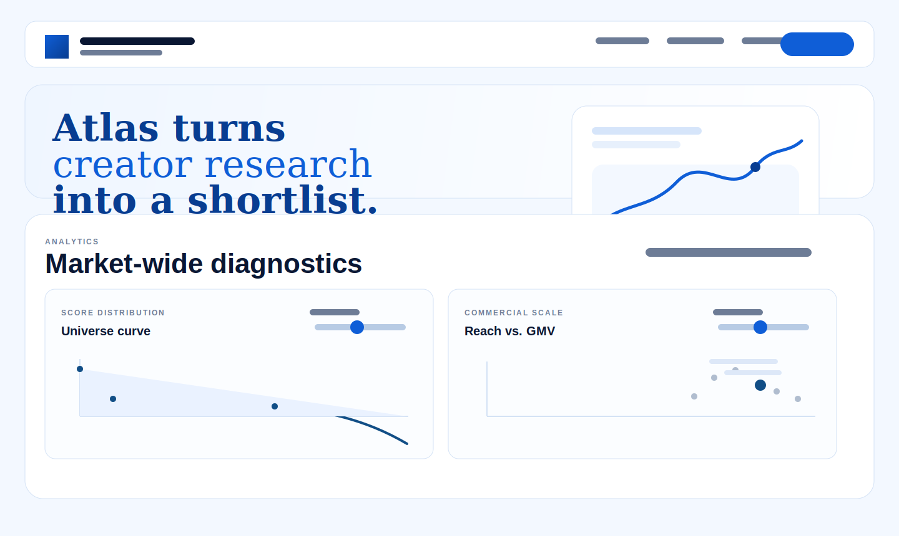

# Atlas Brief

Atlas Brief is a creator-screening product built for the RoC hackathon. It ranks creators using a hybrid model that combines semantic relevance with commercial quality, then presents the result in a guided landing page, an interactive demo, and a short methodology appendix.



## What It Does

- screens the full `creators.json` universe
- runs the official challenge query for `brand_smart_home`
- exports the top 10 as JSON
- presents the results in a polished dashboard with charts, filters, and PDF export

## Quick Start

For the fastest local path with no OpenAI key or Postgres:

```bash
npm install
env EMBEDDING_PROVIDER=local VECTOR_BACKEND=memory npm run demo
npm run dashboard
```

Open:

- `http://127.0.0.1:4173/` for the landing page
- `http://127.0.0.1:4173/demo.html` for the demo
- `http://127.0.0.1:4173/methodology.html` for the methodology page

## Official Challenge Output

The required submission query is:

```text
Affordable home decor for small apartments
```

using the `brand_smart_home` profile.

The generated output file is:

```text
output/brand_smart_home_top10.json
```

## Scoring

### Official challenge ranker

```text
projected_normalized = (projected_score - 60) / 40

final_score =
  100 * (
    alpha * semantic_score +
    (1 - alpha) * projected_normalized
  )
```

This is a convex combination of normalized semantic relevance and normalized projected value.

### Atlas demo score

```text
commercial_quality =
  0.65 * projected_normalized +
  0.20 * engagement_norm +
  0.15 * gmv_norm

relevance_score =
  (industry_match + query_overlap + audience_fit) / 3

atlas_score =
  100 * (
    0.60 * relevance_score +
    0.40 * commercial_quality
  )
```

The demo score is for exploration. It uses equal treatment inside the relevance block, then blends relevance against commercial quality.

## Full Setup

For the intended `OpenAI + Postgres/pgvector` path:

```bash
cp .env.example .env
```

Set:

```env
OPENAI_API_KEY=your_real_key
EMBEDDING_PROVIDER=openai
VECTOR_BACKEND=postgres
DATABASE_URL=your_real_postgres_url
```

Then run:

```bash
npm run ingest
npm run demo
npm run dashboard
```

## Main Commands

```bash
npm run typecheck
npm run ingest
npm run demo
npm run dashboard
```

## Key Files

- `src/searchCreators.ts` - official challenge ranking logic
- `scripts/ingest.ts` - embedding and storage pipeline
- `scripts/demo.ts` - reproducible challenge run
- `dashboard/index.html` - landing page
- `dashboard/demo.html` - live dashboard
- `dashboard/methodology.html` - formulas and references
- `output/brand_smart_home_top10.json` - top 10 submission output

## Notes

- local mode is the easiest review path
- `OpenAI + Postgres/pgvector` is the intended production-style path
- the dashboard can export both JSON and PDF from the demo page
